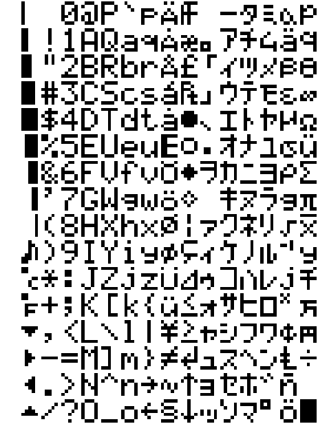

# Scrolling text on pico scroll

## TL;DR

Scrolling text?

[Library for font](https://github.com/graeme-winter/rpi-pico/blob/main/font5x7/font.py) and 
[Code in here](https://github.com/graeme-winter/rpi-pico/blob/main/font5x7/scroller.py)

[Font generated with this](https://github.com/graeme-winter/rpi-pico/blob/main/font5x7/generate.py)

## verbose=true

Given that this is called a pico scroll you would think that scrolling text is literally it's raison d'être right? Nope. Turns out you need to generate your own font library. This in turn involved creating your own e.g. 5x7 pixel bitmap font. Ohai rabbit hole.

Happily someone had already done the work of generating a 5x7 font, which I recycled into something I can encode in Python (and should add to the C API sometime soon, TODO) - grabbed the text defining the font from http://sdf.org/~kt8216/font5x7/unknown-small-5x7.txt then re-encoded to have one byte per column, from top down, using the 7 least significant bits (e.g. 0x00 to 0x7f).

Font, rendered as an image in numpy, looks like:



(this is not particularly amazing to look at).

[Conversion code](https://github.com/graeme-winter/rpi-pico/blob/main/font5x7/generate.py) includes some interesting features - generating the font.py code is easy enough, but this is also copying code in from the source file. The font is encoded as a dictionary, keyed by the byte (i.e. 0x00 -> 0xff) with 5 bytes following which are the left-to-right columns of bits for the bitmap e.g. 

```
    0x61: (0x2,0x15,0x15,0x15,0xf),
    0x62: (0x7f,0x9,0x11,0x11,0xe),
    0x63: (0xe,0x11,0x11,0x11,0x2),
    0x64: (0xe,0x11,0x11,0x9,0x7f),
    0x65: (0xe,0x15,0x15,0x15,0xc),
```

for `a, b, c, d, e`. The API is then implemented, trivially, by mapping these bytes above with into one byte per column, with a single empty column between characters to enhance readability. This bytearray is then passed to the display method, which takes also an offset to apply (between `-17` for just off the right side of the scroll) to `len(bytearray)` for just off the left side - so scrolling is as easy as passing the byte array with offsets in a range.

Given `font.py` the entire API is rather simple.

This will currently work with the standard pimoroni firmware, however I will move the rendering code to a C extension module with similar API and put in a pull request to get this merged in with the public `picoscroll` module.


