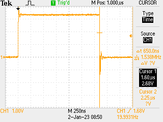

# 2023-01-01

Make a vague effort to improve knowledge more frequently. Today trying to start estimating rp2040 IRQ response times. Start by using `time_us_32()` as a simple time counter (in µs obviously) and hook up one GPIO as output to one as input, start the timer then raise output, count time until IRQ fired...

This seems to count ~ 2µs (+/- 1) so I need to get a higher resolution way of counting time... on oscilloscope get a reasonable measure of this as about 1.75µs -> need a way of measuring this with the rp2040 as this is over 200 ticks so should be easy to measure.... done: used PIO to measure without the `time_us_32()` call and it seems to be _exactly_ 200 cycles which corresponds to 'scope trace:

Code at [this repo.](https://github.com/graeme-winter/rp2040-explore/blob/main/irq-timer)
