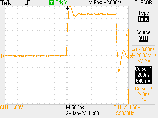

# 2023-01-02

OK, nerd sniped - see how fast I can make the IRQ callbacks. Turns out existing method had a lot of overhead so find a much tighter way (still counting with PIO) - just short of 200ns seems possible, some 25 cycles...



Diffs at [this commit.](https://github.com/graeme-winter/rp2040-explore/commit/b610b5477b2c101f366089d14bc01a68c4212ee9)

[Previous](./2023-01-01.md)

... optimising the PIO program to give finer resolution, get it to two tick resolution (16ns) by playing in µPython:

```python
from machine import Pin, PWM
import rp2

pin = Pin(0, Pin.OUT)

# deterministic source for 500µs pulses (reliably reproduced on 'scope)

pwm = PWM(pin)
pwm.freq(1250)
pwm.duty_ns(500000)

@rp2.asm_pio()
def count_high():
    mov(x, invert(null))
    wait(1, pin, 0)
    label("high")
    jmp(x_dec, "next")
    label("next")
    jmp(pin, "high")
    mov(isr, x)
    push()
    
sm = rp2.StateMachine(0, count_high, jmp_pin=pin)

sm.active(1)

for j in range(100):
    print(0xffffffff - sm.get())

sm.active(0)
```

Reports 31250 which x 16ns gives 500µs as expected:


