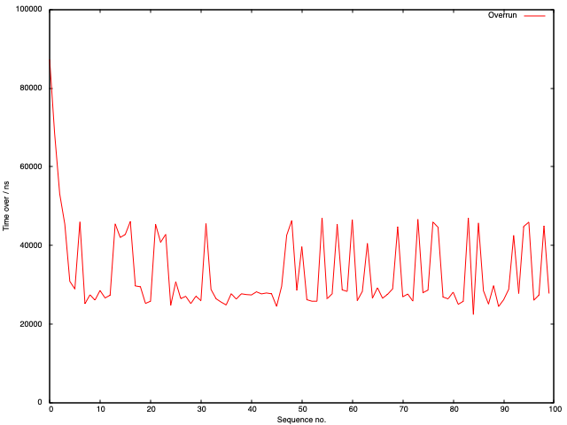

# µPython for real time

Decided I should see what you can do with µPython and real-time programming on the PIO... turns out it works fine but obviously only useful for _very limited_ values of real-time.

Implemented simple time counter on PIO: wait until high, start, while high decrement, return once falls to low: takes two instructions / cycle so 16ns with default config, confirmed [yesterday](./2023-01-02.md) on oscilloscope.

[Example code](https://github.com/graeme-winter/rp2040-explore/tree/main/%C2%B5Python-real-time) for this (other programs will appear): todo assess how "noisy" a busy loop with `sleep()` is...

Like this then:

```python
import time

from machine import Pin
import rp2

p0 = Pin(0, Pin.OUT)


@rp2.asm_pio()
def count_high():
    mov(x, invert(null))
    wait(1, pin, 0)
    label("high")
    jmp(x_dec, "next")
    label("next")
    jmp(pin, "high")
    mov(isr, x)
    push()


sm = rp2.StateMachine(0, count_high, jmp_pin=p0)

sm.active(1)

# target time for sleeping, ms
delta_ms = 50

for j in range(100):
    p0.on()
    time.sleep_ms(delta_ms)
    p0.off()
    delta = (16 * (0xFFFFFFFF - sm.get())) - delta_ms * 1_000_000
    print(f"∂ = {delta} ns")

sm.active(0)
```

Shows that the interaction with µPython gives noisy and measurable overhead: not surprising as `p0.on()` and `p0.off()` will take some finite time to execute (should do the same in C...) - results:



[Previous](./2023-01-02.md) [Next](./2023-01-04.md)
