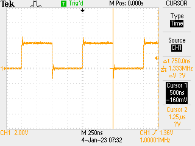

# µPython for real time

Day 2: output - blink example "tidied up" so rather than using `nop()` everywhere use proper counting. Still some scope to polish this (e.g. by preloading the `osr`) but works nicely for generating 1MHz square wave output for 100s or so:

```python
import time

from machine import Pin
import rp2

p0 = Pin(0)

# counter program using side-set to control output
@rp2.asm_pio(sideset_init=rp2.PIO.OUT_LOW)
def square():
    wrap_target()
    mov(x, osr).side(1)
    label("high")
    jmp(x_dec, "high")
    mov(x, osr).side(0)
    label("low")
    jmp(x_dec, "low")
    wrap()


# because 50% duty cycle square wave, need frequency to be even
# in here: clock divider of 12.5 is fine
sm = rp2.StateMachine(0, square, freq=10_000_000, sideset_base=p0)

# counts: two fewer than you think:
#
# mov() takes one instruction
# jmp x_dec only jumps when x_dec comes in as zero
#
# clock into the osr before program starts
sm.put(5 - 2)
sm.exec("pull()")

sm.active(1)
time.sleep(100)
sm.active(0)

# tidy
p0.off()
```

Useful for testing code which would e.g. use the PIO for pulse counting as can send in a well determined number of pulses with given width. Combining this with the timer from yesterday (running on different state machines) could be interesting. Trace demonstrating that this is ~ 1MHz and 2 x 500ns:



Code above could easily have different periods for high / low by clocking a low count into the `isr` as a second scratch register.

Working in this code with the counter from yesterday it looks like the planets align: two state machines, one running counter (which is started first) then the other running this square wave nicely shows that the timing appears to work:

```python
import time

from machine import Pin
import rp2

p0 = Pin(0)

# counter program using side-set to control output
@rp2.asm_pio(sideset_init=rp2.PIO.OUT_LOW)
def square():
    wrap_target()
    mov(x, osr).side(1)
    label("high")
    jmp(x_dec, "high")
    mov(x, osr).side(0)
    label("low")
    jmp(x_dec, "low")
    wrap()


# counter for how many ticks we are high
@rp2.asm_pio()
def count_high():
    mov(x, invert(null))
    wait(1, pin, 0)
    label("high")
    jmp(x_dec, "next")
    label("next")
    jmp(pin, "high")
    mov(isr, x)
    push()


sm0 = rp2.StateMachine(0, square, sideset_base=p0)
sm1 = rp2.StateMachine(1, count_high, jmp_pin=p0)

# half a second - so should report 500,000,000ns
sm0.put(62500000 - 2)
sm0.exec("pull()")

# start the reader first as we are waiting on high
sm1.active(1)
sm0.active(1)

for j in range(10):
    high = 16 * (0xFFFFFFFF - sm1.get())
    print(high)

sm0.active(0)
sm1.active(0)

# tidy
p0.off()
```

Output is indeed printing 500,000,000 every second... 🥸 but nice.

[Previous](./2023-01-03.md) [Next](./2023-01-05.md)
