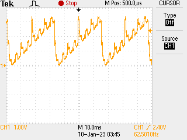
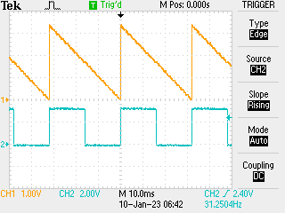

# PWM day 2

Want to more finely control PWM, so use registers (allows all 8 to be launched in sync, say)... well turns out I am not certain about that: set them up with registers then trigger all at once does not seem to work as I would expect:

```python
from machine import mem32

# set up PWM function on GPIO, 2, 4, 6, 8, 10 because
# each is wired to a unique PWM
IO_BANK_BASE = 0x40014000
for j in 0, 2, 4, 6, 8, 10:
    GPIO_CTRL = IO_BANK_BASE + j * 0x8 + 0x4
    mem32[GPIO_CTRL] = 0x4

# activate PWM
PWM_TOP = 0x40050000
CH_CSR = PWM_TOP + 0x0
CH_DIV = PWM_TOP + 0x4
CH_CTR = PWM_TOP + 0x8
CH_CC = PWM_TOP + 0xC
CH_TOP = PWM_TOP + 0x10
CH_WIDTH = 0x14

PWM_EN = PWM_TOP + 0xA0

for j in 0, 1, 2, 3, 4, 5:
    TOP = 1000 * 2 ** j - 1
    CC = 500 * 2 ** j - 1
    X = CH_WIDTH * j
    mem32[CH_CSR + X] = 0x0
    mem32[CH_DIV + X] = 125 << 4
    mem32[CH_TOP + X] = TOP
    mem32[CH_CC + X] = CC

# enable PWM 0....5
mem32[PWM_EN] = 0x3F
```

Looks like there is a residual timing issue:



May take some debugging or it is a lousy resistor DAC (but it worked fine with manual set). Update: turns out that the code is good, the DAC is OK and what was needed was a hard reset of the board: some of the PWM counters were out of sync. Hard reset brought into sync. Suspect that assignment of `CH_CTR` to `0x0` would have achieved the same...



[Previous](./2023-01-09.md)
