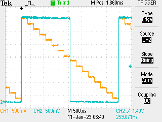

# PIO for DAC driving

Driving a DAC with a PIO is well established technology in C: the [pico signal generator](https://github.com/graeme-winter/pico-signal-generator) does exactly this and will be revisited from µPython later. Meanwhile however the question arises of how to send the symbols for a 6-bit DAC from the PIO without messing around with DMA right now.

PIO is good for up to 5 bit numbers because of the structure of the assembly. Simply counting down from 31 is therefore a good way of driving five of the bits, and the sixth can be done by side-set e.g.

```python
from machine import Pin
from rp2 import PIO, StateMachine, asm_pio

# use pin0 as sideset, 1...5 as "data"
pins = [Pin(j) for j in range(6)]


@asm_pio(
    sideset_init=PIO.OUT_LOW,
    out_init=(PIO.OUT_LOW, PIO.OUT_LOW, PIO.OUT_LOW, PIO.OUT_LOW, PIO.OUT_LOW),
    out_shiftdir=PIO.SHIFT_RIGHT,
)
def saw():
    wrap_target()
    set(x, 31)
    label("tick")
    mov(osr, x)
    out(pins, 5).side(1)
    nop()
    nop().side(0)
    jmp(x_dec, "tick")
    wrap()


sm = StateMachine(0, saw, freq=12500, sideset_base=pins[0], out_base=pins[1])
sm.active(1)
```

This is fine but the timing needs some work, as each of the symbols from `0b111111` to `0b000000` are visited but not for the same amount of time. Running with just four bits (so 16 symbols) with

```python
from machine import Pin
from rp2 import PIO, StateMachine, asm_pio

# use pin0 as sideset, 1...5 as "data"
pins = [Pin(j) for j in range(6)]
for p in pins:
    p.off()


@asm_pio(
    sideset_init=PIO.OUT_LOW,
    out_init=(PIO.OUT_LOW, PIO.OUT_LOW, PIO.OUT_LOW),
    out_shiftdir=PIO.SHIFT_RIGHT,
)
def saw():
    wrap_target()
    set(x, 31)
    label("tick")
    mov(osr, x)
    out(pins, 5).side(1)
    nop()[1]
    nop().side(0)
    jmp(x_dec, "tick")
    wrap()


sm = StateMachine(0, saw, freq=12500, sideset_base=pins[2], out_base=pins[3])
sm.active(1)
```

Showed where the extra no-op was needed to balance the counting... at least it appears to be so: the scope _did_ seem to show some timing jitter which is odd...



To do this better will involve using a _second_ PIO program to read from the pins and send the symbols back out to main memory for manual inspection -> DMA time...

[Previous](./2023-01-10.md)
