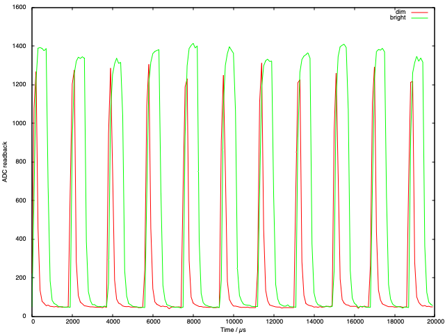
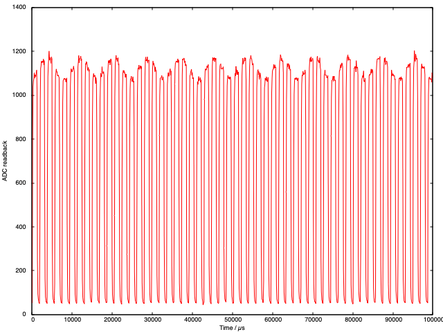

# ADC Pacing: putting something to use

The [ADC / DMA example](./2023-01-08.md) code ran the ADC direct to DMA, but did not pace beyond that e.g. to allow the ADC to work sub 500 kHz. There is a lamp in a hotel room, which has a dimmer switch. I think this is a PWM control over an LED. Test the hypothesis with a photodiode.

No 'scope, so want to do something which allows `print()` from µPython - so probably _don't_ want 500 kHz so finally figure out the ADC pacing registers.

Turns out to be simple: ADC is clocked on the USB clock at 48 MHz, and the question is _how many extra clock ticks between triggers_. If I want to record at say 10 kHz for say 200 time points (i.e. 20 ms) it will therefore need the `ADC DIV` register to be set to 4799:

```python
from uctypes import addressof
from machine import mem32
from array import array
import math

# configure the scratch buffer
COUNT = 200
scratch = array("H", [0xFFFF for j in range(COUNT)])
address = addressof(scratch)

# zero-out the pin (set the function to NULL, needed for ADC)
IO_BANK_BASE = 0x40014000
GPIO26_CTRL = IO_BANK_BASE + 0xD4
mem32[GPIO26_CTRL] = 0b11111

# ADC inc. FIFO - registers
ADC_BASE = 0x4004C000
ADC_CS = ADC_BASE + 0x0
ADC_RESULT = ADC_BASE + 0x4
ADC_FCS = ADC_BASE + 0x8
ADC_FIFO = ADC_BASE + 0xC
ADC_DIV = ADC_BASE + 0x10

# DMA registers
DMA_BASE = 0x50000000
CH0_READ_ADDR = DMA_BASE + 0x0
CH0_WRITE_ADDR = DMA_BASE + 0x4
CH0_TRANS_COUNT = DMA_BASE + 0x8
CH0_CTRL_TRIG = DMA_BASE + 0xC

# control register: see table 124 in data sheet - follow ADC DREQ,
# increment write pointer, data size 2 bytes (N.B. will be 12 bit
# not 16 like usual ADC with read_u16())
#
# DREQ 36 / 0x24 for ADC for CTRL.DREQ_SEL
QUIET = 0x1 << 21
DREQ_ADC = 0x24 << 15
WRITE_INCR = 0x1 << 5
DATA_SIZE = 0x1 << 2
ENABLE = 0x1

mem32[CH0_READ_ADDR] = ADC_FIFO
mem32[CH0_WRITE_ADDR] = address
mem32[CH0_TRANS_COUNT] = COUNT
mem32[CH0_CTRL_TRIG] = QUIET + DREQ_ADC + WRITE_INCR + DATA_SIZE + ENABLE

# slow down ADC to 10,000 samples / second - calculation is
# that this is *triggered* every (DIV + 1) clock ticks on a
# 48 MHz clock, DIV needs to be either 0 or >= 95 to allow
# 96 ticks to perform conversion
mem32[ADC_DIV] = 4799 << 8
  
# drain FIFO before we start
while (mem32[ADC_FCS] >> 16) & 0xF:
    _ = mem32[ADC_FIFO]

# ADC_FIFO configuration - set threshold, clear, enable DREQ and enable FIFO
THRESH = 0x1 << 24
CLEAR = (0x1 << 11) + (0x1 << 10)
DREQ_EN = 0x1 << 3
FIFO_EN = 0x1
mem32[ADC_FCS] = THRESH + CLEAR + DREQ_EN + FIFO_EN

# ADC configuration - since using channel 0 only just enable and start many
BUSY = 0x1 << 24
mem32[ADC_CS] = 0x8 + 0x1

while mem32[CH0_CTRL_TRIG] & BUSY:
    continue

# disable ADC
mem32[ADC_CS] = 0

for j, s in enumerate(scratch):
    print(100 * j, s)
```

Setting this up and pressing go gives:



Where it is clear that they are actually using PWM for the lamp control _but_ with a weird frequency... make of that what you will. Additionally ran for 100 ms and noticed:



Where you can see a second signal overlapping the high frequency one: 12 peaks in 100 ms would suggest 60 Hz AC signal bleeding through whatever electronics they are using 🤓
