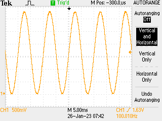
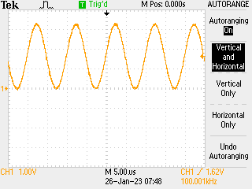

# Practical example #2: DMA signal generator

Already implemented in C in the pico-signal-generator but now I know about driving the DMA etc. from µPython it feels like something I should be able to do more flexibly. Spoiler: it works fine, just takes some careful thinking.

## Wiring

Wire up an 8-bit resistor DAC, off pins 0...7 of the pico. If fewer than 8 bits ensure that the most significant bits are taken (e.g. 2...7 if 6 bit).

## Software

Here we are using the PIO to push 8 bits / cycle to the GPIO: to pace this use the DREQ for the PIO TX buffer (and join buffers, not sure how critical that is for 8 bits / cycle). Also run at much less than 125MHz for useful test coverage for ADC reading (though will assess how well it works at full clock speed.)

PIO program is trivial: `out pins 8` with some supporting infrastructure (autopull on 32 bit boundary, right shift etc.) - the DMA electronics are doing the heavy lifting here. Setting up the signal buffer is also relatively simple: 100,000 byte buffer of 8 bit samples, in the example configured as 1,000 samples / cycle copied 100 times. The DMA is slightly more complex as we have channels 0, 1 working as a tag team, each triggering the other at the end of the cycle so we need a µPython loop to keep these topped up, reconfiguring the channels once they are finished. That could and should be moved to a separate thread so the main loop can update the signal buffer.

## Code

100+ lines of nonsense pseudo-µPython:

```python
# sine wave data source -> generate 100,000 point sine wave buffer
# and then push this out through pio0 at 100kHz -> divider of
# 1250 etc.

import math
from machine import Pin, mem32, UART
from uctypes import addressof
from rp2 import PIO, StateMachine, asm_pio

# DREQ definitions
DREQ_PIO0_TX0 = 0

# register definitions
PIO0_BASE = 0x50200000
PIO0_CTRL = PIO0_BASE + 0x00
PIO0_FSTAT = PIO0_BASE + 0x04
PIO0_TXF0 = PIO0_BASE + 0x10

# DMA registers
DMA_BASE = 0x50000000
CH0_READ_ADDR = DMA_BASE + 0x00
CH0_WRITE_ADDR = DMA_BASE + 0x04
CH0_TRANS_COUNT = DMA_BASE + 0x08
CH0_CTRL_TRIG = DMA_BASE + 0x0C
CH0_CTRL = DMA_BASE + 0x10

CH1_READ_ADDR = DMA_BASE + 0x40
CH1_WRITE_ADDR = DMA_BASE + 0x44
CH1_TRANS_COUNT = DMA_BASE + 0x48
CH1_CTRL_TRIG = DMA_BASE + 0x4C
CH1_CTRL = DMA_BASE + 0x50

MULTI_CHAN_TRIGGER = DMA_BASE + 0x430

pins = [Pin(j) for j in range(8)]
led = Pin(25, Pin.OUT)


@asm_pio(
    out_init=(
        PIO.OUT_LOW,
        PIO.OUT_LOW,
        PIO.OUT_LOW,
        PIO.OUT_LOW,
        PIO.OUT_LOW,
        PIO.OUT_LOW,
        PIO.OUT_LOW,
        PIO.OUT_LOW,
    ),
    out_shiftdir=PIO.SHIFT_RIGHT,
    fifo_join=PIO.JOIN_TX,
    autopull=True,
    pull_thresh=32,
)
def tick():
    wrap_target()
    out(pins, 8)
    wrap()


# set up data: 1kHz sine wave
COUNT = 100_000
data = bytearray(COUNT)

for j in range(1000):
    data[j] = int(128 + 127 * math.sin(0.001 * 2 * math.pi * j))
    for k in range(1, 100):
        data[j + 1000 * k] = data[j]

# FIXME run DMA in a second thread so the main thread could be used to
# update the data array (say)

# set up DMA
#        QUIET         DREQ                 CHAIN      READ INCR   4-byte     ENABLE
CTRL0 = (1 << 21) + (DREQ_PIO0_TX0 << 15) + (1 << 11) + (1 << 4) + (2 << 2) + (3 << 0)
CTRL1 = (1 << 21) + (DREQ_PIO0_TX0 << 15) + (0 << 11) + (1 << 4) + (2 << 2) + (3 << 0)

mem32[CH0_READ_ADDR] = addressof(data)
mem32[CH0_WRITE_ADDR] = PIO0_TXF0
mem32[CH0_TRANS_COUNT] = COUNT // 4
mem32[CH0_CTRL] = CTRL0

mem32[CH1_READ_ADDR] = addressof(data)
mem32[CH1_WRITE_ADDR] = PIO0_TXF0
mem32[CH1_TRANS_COUNT] = COUNT // 4
mem32[CH1_CTRL] = CTRL1

# set up PIO
sm0 = StateMachine(0, tick, freq=100_000, out_base=pins[0])

# trigger DMA0 and PIO
mem32[MULTI_CHAN_TRIGGER] = 1
mem32[PIO0_CTRL] = 1

BUSY = 1 << 24

while True:
    led.toggle()
    while mem32[CH0_CTRL_TRIG] & BUSY:
        continue
    # set up CH0 again
    mem32[CH0_READ_ADDR] = addressof(data)
    mem32[CH0_WRITE_ADDR] = PIO0_TXF0
    mem32[CH0_CTRL] = CTRL0
    mem32[CH0_TRANS_COUNT] = COUNT // 4
    while mem32[CH1_CTRL_TRIG] & BUSY:
        continue
    # set up CH1 again
    mem32[CH1_READ_ADDR] = addressof(data)
    mem32[CH1_WRITE_ADDR] = PIO0_TXF0
    mem32[CH1_CTRL] = CTRL1
    mem32[CH1_TRANS_COUNT] = COUNT // 4
```

But it gets the job done.

## Results

More jitter on the frequency than I would expect but overall works well:



Some debugging could be useful but on balance happy with that. Update: seems to work fine with 125,000 elements in data array and outputting at 125MHz -> reloading the buffer every 1ms:



[Previous](./2023-01-23.md) [Next](./2023-01-27.md)
