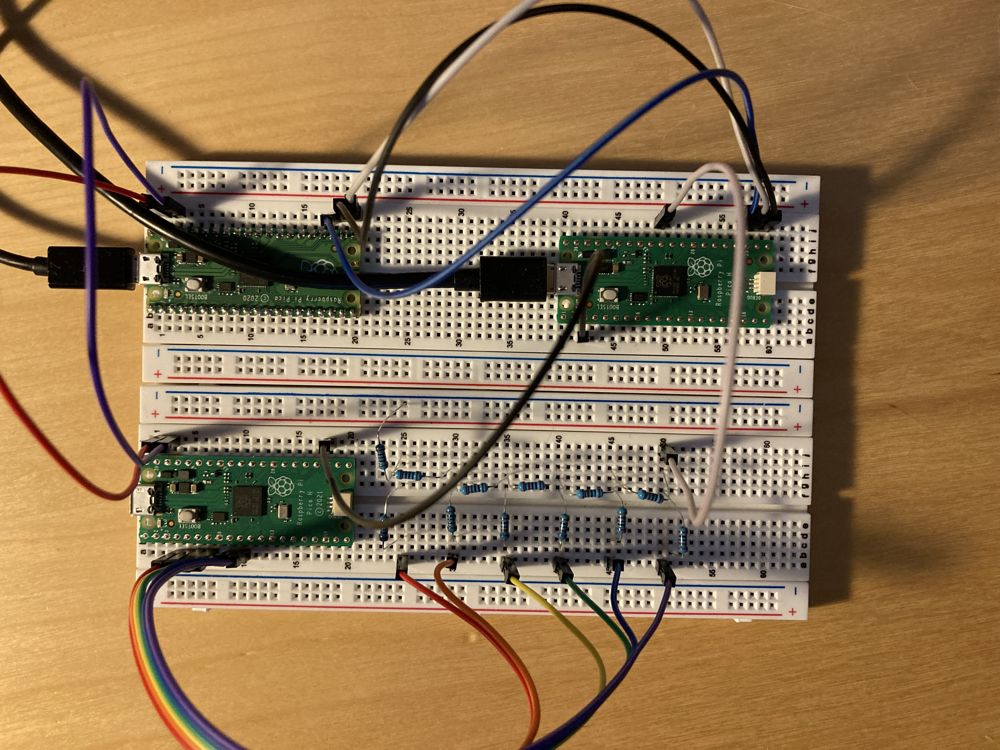
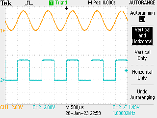
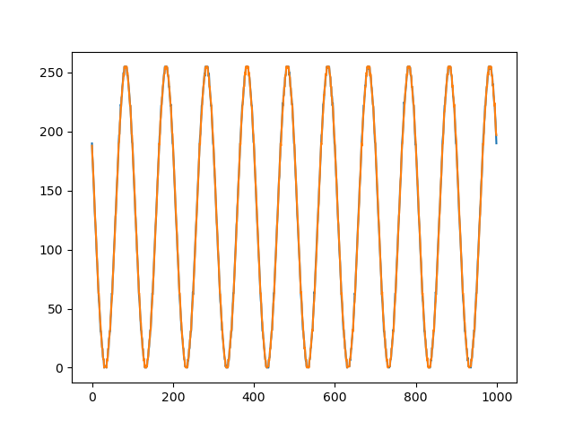
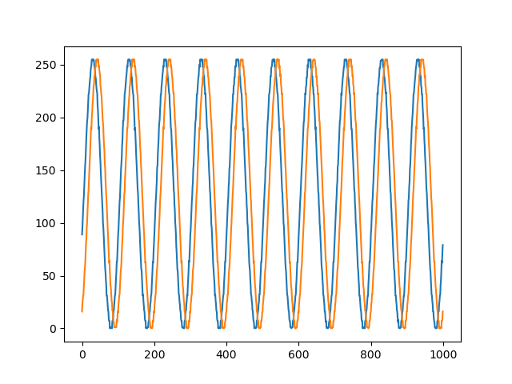

# Putting it all together

Recent work has got a few components configured:

- ADC / UART bridge to read data from ADC and send over to UART
- 3rd party UART / USB bridge to simplify reading data on real computer
- signal generator using chained DMA

Putting these together we have something we can _test_. A little wiring is needed now:



## Components

Three picos - 

- signal generator wired to a resistor DAC (in this case taking 6 MSB due to what resistors I have to hand)
- ADC / UART pico
- UART / USB pico [running this firmware](https://github.com/Noltari/pico-uart-bridge)

## Signal Generator

Set the signal generator cooking at 1kHz:



(also showing the MSB of the signal output as square wave). Data are a little noisy, because this is made from cheap components. Signal generator code:

```python
# sine wave data source -> generate 125,000 point sine wave buffer
# and then push this out through pio0 at 1.25MHz

import math
from machine import Pin, mem32, UART
from uctypes import addressof
from rp2 import PIO, StateMachine, asm_pio
import _thread

# DREQ definitions
DREQ_PIO0_TX0 = const(0)

# register definitions
PIO0_BASE = const(0x50200000)
PIO0_CTRL = const(PIO0_BASE + 0x00)
PIO0_FSTAT = const(PIO0_BASE + 0x04)
PIO0_TXF0 = const(PIO0_BASE + 0x10)

# DMA registers
DMA_BASE = const(0x50000000)
CH0_READ_ADDR = const(DMA_BASE + 0x00)
CH0_WRITE_ADDR = const(DMA_BASE + 0x04)
CH0_TRANS_COUNT = const(DMA_BASE + 0x08)
CH0_CTRL_TRIG = const(DMA_BASE + 0x0C)
CH0_CTRL = const(DMA_BASE + 0x10)

CH1_READ_ADDR = const(DMA_BASE + 0x40)
CH1_WRITE_ADDR = const(DMA_BASE + 0x44)
CH1_TRANS_COUNT = const(DMA_BASE + 0x48)
CH1_CTRL_TRIG = const(DMA_BASE + 0x4C)
CH1_CTRL = const(DMA_BASE + 0x50)

MULTI_CHAN_TRIGGER = const(DMA_BASE + 0x430)

pins = [Pin(j) for j in range(8)]
led = Pin(25, Pin.OUT)


@asm_pio(
    out_init=(
        PIO.OUT_LOW,
        PIO.OUT_LOW,
        PIO.OUT_LOW,
        PIO.OUT_LOW,
        PIO.OUT_LOW,
        PIO.OUT_LOW,
        PIO.OUT_LOW,
        PIO.OUT_LOW,
    ),
    out_shiftdir=PIO.SHIFT_RIGHT,
    fifo_join=PIO.JOIN_TX,
    autopull=True,
    pull_thresh=32,
)
def tick():
    wrap_target()
    out(pins, 8)
    wrap()


# set up data: 1kHz sine wave
COUNT = const(125_000)
data = bytearray(COUNT)

for j in range(1250):
    data[j] = int(128 + 127 * math.sin(0.0008 * 2 * math.pi * j))
    for k in range(1, 100):
        data[j + 1250 * k] = data[j]

# set up DMA
#        QUIET         DREQ                 CHAIN      READ INCR   4-byte     ENABLE
CTRL0 = (1 << 21) + (DREQ_PIO0_TX0 << 15) + (1 << 11) + (1 << 4) + (2 << 2) + (3 << 0)
CTRL1 = (1 << 21) + (DREQ_PIO0_TX0 << 15) + (0 << 11) + (1 << 4) + (2 << 2) + (3 << 0)

mem32[CH0_READ_ADDR] = addressof(data)
mem32[CH0_WRITE_ADDR] = PIO0_TXF0
mem32[CH0_TRANS_COUNT] = COUNT // 4
mem32[CH0_CTRL] = CTRL0

mem32[CH1_READ_ADDR] = addressof(data)
mem32[CH1_WRITE_ADDR] = PIO0_TXF0
mem32[CH1_TRANS_COUNT] = COUNT // 4
mem32[CH1_CTRL] = CTRL1

# set up PIO
sm0 = StateMachine(0, tick, freq=1_250_000, out_base=pins[0])

COUNT4 = const(COUNT // 4)
PTR = addressof(data)

BUSY = 1 << 24


@micropython.viper
def go():
    # trigger DMA0 and PIO
    mem32[MULTI_CHAN_TRIGGER] = 1
    mem32[PIO0_CTRL] = 1

    while True:
        while mem32[CH0_CTRL_TRIG] & BUSY:
            continue
        mem32[CH0_READ_ADDR] = PTR
        mem32[CH0_WRITE_ADDR] = PIO0_TXF0
        mem32[CH0_CTRL] = CTRL0
        mem32[CH0_TRANS_COUNT] = COUNT4
        while mem32[CH1_CTRL_TRIG] & BUSY:
            continue
        mem32[CH1_READ_ADDR] = PTR
        mem32[CH1_WRITE_ADDR] = PIO0_TXF0
        mem32[CH1_CTRL] = CTRL1
        mem32[CH1_TRANS_COUNT] = COUNT4


_thread.start_new_thread(go, ())
```

N.B. uses a few slight optimisations to ensure that the data continues to flow.

## Bridge

Set this up to run at 115,200 * 16 BAUD rate as this seemed to work well over the UART / USB bridge and seems like a "round number" - as well as allowing > 100 kB/s transfer. Data paced by ADC timing:

```python
from machine import Pin, mem32, UART
from uctypes import addressof
import time

# UART stuff
uart0 = UART(0, baudrate=115200*16, tx=Pin(16), rx=Pin(17))

UART0_BASE = 0x40034000
UART0_DR = UART0_BASE + 0x0
UART0DMACR = UART0_BASE + 0x48

# enable UART0 DMA (TX)
mem32[UART0DMACR] = 1 << 1

# set up ADC channel

# zero-out the pin (set the function to NULL, needed for ADC)
IO_BANK_BASE = 0x40014000
GPIO26_CTRL = IO_BANK_BASE + 0xD4
mem32[GPIO26_CTRL] = 0b11111

# ADC inc. FIFO - registers
ADC_BASE = 0x4004C000
ADC_CS = ADC_BASE + 0x0
ADC_RESULT = ADC_BASE + 0x4
ADC_FCS = ADC_BASE + 0x8
ADC_FIFO = ADC_BASE + 0xC
ADC_DIV = ADC_BASE + 0x10


# DMA registers
DMA_BASE = 0x50000000
CH0_READ_ADDR = DMA_BASE + 0x0
CH0_WRITE_ADDR = DMA_BASE + 0x4
CH0_TRANS_COUNT = DMA_BASE + 0x8
CH0_CTRL_TRIG = DMA_BASE + 0xC

# control register: see table 124 in data sheet - follow ADC DREQ,
# increment write pointer, data size 2 bytes (N.B. will be 12 bit
# not 16 like usual ADC with read_u16())
#
# DREQ 36 / 0x24 for ADC for CTRL.DREQ_SEL
QUIET = 0x1 << 21
DREQ_ADC = 0x24 << 15
DATA_SIZE = 0x0 << 2
ENABLE = 0x1

mem32[CH0_READ_ADDR] = ADC_FIFO
mem32[CH0_WRITE_ADDR] = UART0_DR
mem32[CH0_TRANS_COUNT] = 100000
mem32[CH0_CTRL_TRIG] = QUIET + DREQ_ADC + DATA_SIZE + ENABLE

# drain FIFO before we start
while (mem32[ADC_FCS] >> 16) & 0xF:
    _ = mem32[ADC_FIFO]

# ADC_FIFO configuration - set threshold, clear, enable DREQ and enable FIFO
THRESH = 0x1 << 24
CLEAR = (0x1 << 11) + (0x1 << 10)
DREQ_EN = 0x1 << 3
SHIFT = 0x1 << 1
FIFO_EN = 0x1
mem32[ADC_FCS] = THRESH + CLEAR + DREQ_EN + SHIFT + FIFO_EN

# 100000 samples / second
mem32[ADC_DIV] = 479 << 8

# ADC configuration - since using channel 0 only just enable and start many
t0 = time.ticks_us()
mem32[ADC_CS] = 0x8 + 0x1

BUSY = 0x1 << 24

while mem32[CH0_CTRL_TRIG] & BUSY:
    continue
t1 = time.ticks_us()

mem32[ADC_CS] = 0x0
print(f"100000 samples transferred in {1e-6 * (t1 - t0):.2f}s")
```

## Host

Read 100,000 points, plot some from the start and end to get an idea if they remain in sync - spoilers, they appear to...

```python
import numpy
import serial
from matplotlib import pyplot

tty = serial.Serial("/dev/tty.usbmodem14101", 115200 * 16)

SIZE = 100_000

bytes = tty.read(SIZE)
data = numpy.frombuffer(bytes, dtype=numpy.uint8).astype(numpy.uint32)

tty.close()

x = numpy.array(range(1000))
y = data.astype(numpy.uint8)

y0 = y[1000:2000]
y1 = y[-2000:-1000]

pyplot.plot(x, y0)
pyplot.plot(x, y1)
pyplot.show()
```

Output:



## Conclusion

You can indeed to hard-ish real time programming just fine with µPython -> win. Could merge the ADC / UART and UART / USB bridges by re-writing in C (since USB is interrupt driven, essentially impossible in µPython.) Would be good to see how long this could run for -> next experiment... run for 10,000,000 samples and again print 1000 from the start and end:



Turns out there is some phase shift here over 100s - of order µs? - so investigate further but that could very well be a difference in the CPU clock of the picos...

[Previous](./2023-01-26.md) [Next](./2023-01-31.md)
