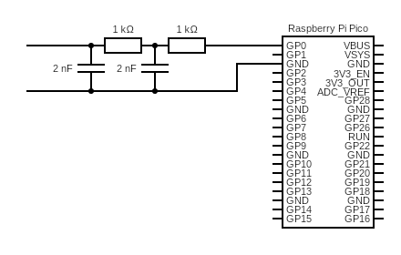
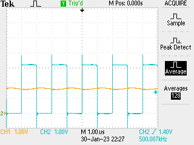
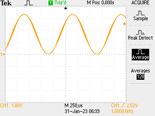

# Analogue is Hard

So, have the R2R ladder resistor DAC as one option for analogue output, but that is annoying to make as it turns out to be very sensitive to the precise resistance of components and my resistors are ... cheap. So try another option: PWM + two stage low pass filter:



Actually they were 2.2nF capacitors but that rounds to a nonsense value on the web page which generates the diagram. This is timed so that RC ~ 2ms i.e. suitable for 500kHz use: by a happy accident what you would get with a PWM counting to 250 (i.e. about 8 bits) at 125MHz.

## Code

This one is easy and recycles old register bashing code: start a PWM with a count-to of 249 (i.e. counts 0...249 inclusive) and then use DMA to push the compare value in on every PWM wrap. The register used for this maps to A and B -> need a 32 bit value with only lower 8 bits set which is annoying. Other than that, almost the same as the code from the [signal generator before](./2023-01-27.md).

```python
from machine import mem32, Pin
import math
from uctypes import addressof
import _thread

# set up data array
COUNT = const(100_000)
data = bytearray(COUNT)
PTR = addressof(data)

for j in range(500):
    x = int(125 + 124 * math.sin(0.002 * 2 * math.pi * j))
    for k in range(50):
        mem32[PTR + j * 4 + 2000 * k] = x

# set up DMA
DREQ_PWM_WRAP0 = const(24)

# PWM registers
IO_BANK_BASE = 0x40014000
GPIO_CTRL = IO_BANK_BASE + 0x4
mem32[GPIO_CTRL] = 0x4

# activate PWM
PWM_TOP = const(0x40050000)
CH_CSR = const(PWM_TOP + 0x0)
CH_DIV = const(PWM_TOP + 0x4)
CH_CTR = const(PWM_TOP + 0x8)
CH_CC = const(PWM_TOP + 0xC)
CH_TOP = const(PWM_TOP + 0x10)

PWM_EN = const(PWM_TOP + 0xA0)

# DMA registers
DMA_BASE = const(0x50000000)
CH0_READ_ADDR = const(DMA_BASE + 0x00)
CH0_WRITE_ADDR = const(DMA_BASE + 0x04)
CH0_TRANS_COUNT = const(DMA_BASE + 0x08)
CH0_CTRL_TRIG = const(DMA_BASE + 0x0C)
CH0_CTRL = const(DMA_BASE + 0x10)

CH1_READ_ADDR = const(DMA_BASE + 0x40)
CH1_WRITE_ADDR = const(DMA_BASE + 0x44)
CH1_TRANS_COUNT = const(DMA_BASE + 0x48)
CH1_CTRL_TRIG = const(DMA_BASE + 0x4C)
CH1_CTRL = const(DMA_BASE + 0x50)

MULTI_CHAN_TRIGGER = const(DMA_BASE + 0x430)


#        QUIET         DREQ                 CHAIN      READ INCR   4-byte     ENABLE
CTRL0 = (1 << 21) + (DREQ_PWM_WRAP0 << 15) + (1 << 11) + (1 << 4) + (2 << 2) + (3 << 0)
CTRL1 = (1 << 21) + (DREQ_PWM_WRAP0 << 15) + (0 << 11) + (1 << 4) + (2 << 2) + (3 << 0)


mem32[CH0_READ_ADDR] = PTR
mem32[CH0_WRITE_ADDR] = CH_CC
mem32[CH0_TRANS_COUNT] = COUNT // 4
mem32[CH0_CTRL] = CTRL0

mem32[CH1_READ_ADDR] = PTR
mem32[CH1_WRITE_ADDR] = CH_CC
mem32[CH1_TRANS_COUNT] = COUNT // 4
mem32[CH1_CTRL] = CTRL1


mem32[CH_CSR] = 0x0
mem32[CH_TOP] = 249
mem32[CH_CC] = 0

BUSY = 1 << 24

led = Pin(25, Pin.OUT)


@micropython.viper
def go():
    # trigger DMA0 and PIO
    mem32[MULTI_CHAN_TRIGGER] = 1
    mem32[PWM_EN] = 1

    while True:
        led.toggle()
        while mem32[CH0_CTRL_TRIG] & BUSY:
            continue
        mem32[CH0_READ_ADDR] = PTR
        mem32[CH0_WRITE_ADDR] = CH_CC
        mem32[CH0_CTRL] = CTRL0
        mem32[CH0_TRANS_COUNT] = COUNT // 4
        while mem32[CH1_CTRL_TRIG] & BUSY:
            continue
        mem32[CH1_READ_ADDR] = PTR
        mem32[CH1_WRITE_ADDR] = CH_CC
        mem32[CH1_CTRL] = CTRL1
        mem32[CH1_TRANS_COUNT] = COUNT // 4


go()
```

## Results

The results are a little messy because we are running the signal through a low pass filter which will also retard the pulses, though given the comparison between the PWM time (2µs) and signal frequency (1ms) we can kinda ignore that. 50% constant duty shows some ripple:



This will be impossible to avoid in the long game and replaces the LSB limits in the R2R DAC. Since wave comes through OK:



Will be interesting to compare this with the R2R version.
