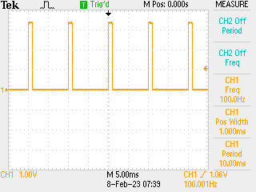

# Assembly GPIO

Control GPIO over ARM assembly... to get PIO like performance on a CPU core, for learning purposes.

TL;DR - you can do this fine, just need to be able to count.

## Goal

PIO like control (visible on a 'scope) of GPIO pins from µPython via `asm_thumb` decorator.

## Code

Code: makes extensive use of `asm_thumb` decorator to embed assembly:

```python
import machine
import time

# constants - only using the XOR register
SIO_BASE = const(0xD0000000)
GPIO_OUT_XOR = const(SIO_BASE + 0x1C)

# configure GPIO: could have set up in registers but this easier
led = machine.Pin(25, machine.Pin.OUT)
out = machine.Pin(0, machine.Pin.OUT)


@micropython.asm_thumb
def asm(r0, r1, r2):
    # save the OUT_XOR address
    mov(r7, r0)

    # save the number of cycles to count to for high, minus one
    mov(r6, r1)
    sub(r6, r6, 1)

    # 10% duty cycle -> 9x as much low, one less cycle again
    mov(r3, 9)
    mul(r3, r1)
    sub(r3, r3, 1)

    # save the number of repeats (macrocycles)
    mov(r5, r2)

    # set up r4 with bit I want - 1 << 25 | 1 for LED + GPIO0
    # N.B. set up already from µPython standard constructor code
    mov(r4, 1)
    mov(r2, 25)
    lsl(r4, r2)
    add(r4, r4, 1)

    # start of macrocycle loop
    label(cycle)

    # switch on -> store value to XOR register
    str(r4, [r7, 0])

    # set up counter for "high"
    mov(r2, r6)

    # countdown loop - N.B. no CBNZ on thumb, nop makes it 5x
    label(on)
    sub(r2, r2, 1)
    cmp(r2, 0)
    nop()
    bne(on)

    # 4 nops to pad on to 5 extra cycles -> bne took one
    nop()
    nop()
    nop()
    nop()

    # switch off - same shape as above
    str(r4, [r7, 0])
    mov(r2, r3)

    label(off)
    sub(r2, r2, 1)
    cmp(r2, 0)
    nop()
    bne(off)

    # end of macrocycle branch
    sub(r5, r5, 1)
    cmp(r5, 0)
    bne(cycle)


asm(GPIO_OUT_XOR, 25000, 100000)
```

## Results

Oscilloscope trace -> 👍


