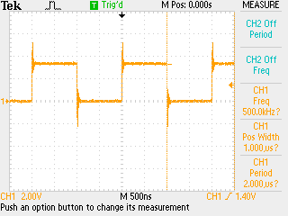

# Bare metal assembly on rp2040

About time I started to learn how to do this _properly_ so start doing some ARM thumb programming on pico - have to use the SDK framework if not the SDK to get the loader etc. set up.

## Hello

Simple one to start - Hello, World! - which also sends a tick _but_ relies on `printf` and `stdio_init_all` external functions so really is not assembly:

```assembly
.thumb_func
.global main

main:
    mov r7, #0
    bl stdio_init_all
loop:
    ldr r0, =hello
    add r7, #1
    mov r1, r7
    bl printf
    b loop

.data
.align 4
hello: .asciz "Hello, world! %d\n"
```

Does show how functions are called from assembly, and the use of the `.data` code section, but that is about it.

## Blinky

This is obviously the second basic task which is a lot more bare metal. Examples everywhere have you set up the GPIO etc. with function calls which really is cheating so this manually sets up all the registers:

```assembly
.thumb_func
.global main
.align 2
main:
    mov r2, #5
    ldr r1, gpioc0
    str r2, [r1, #0x4]
    ldr r1, gpioc1
    str r2, [r1, #0x4c]

    ldr r1, gpiod
    mov r2, #48
    str r2, [r1, #0x4]
    str r2, [r1, #0x68]

    ldr r1, sio
    ldr r2, led
    str r2, [r1, #0x20]
loop:
    str r2, [r1, #0x1c]
    ldr r0, count
    nop
tick:
    sub r0, r0, #1
    cmp r0, #0
    bne tick
    b loop

.align 4
gpioc0: .word 0x40014000
gpioc1: .word 0x40014080
gpiod:  .word 0x4001c000
sio:    .word 0xd0000000
led:    .word 0x2000001
count:  .word 30
```

Note that the data items are _not_ in a `.data` block - which means that they are local and the `ldr` can be performed as a single step rather than first loading the _address_ of the datum before then loading the datum. Otherwise you would load e.g. `=sio` into a register before loading the _value_ of `sio`. Because the M0+ is a single issue core can count instructions here (`ldr`, `str` take two, `b` takes two, `cmp` one etc.) to work out that each cycle takes four ticks. Thus, the full cycle time with the added `nop` is `4 x count + 5` i.e. 125, so we have a 500 kHz square wave here:



No external functions used here to implement the program but a lot of extra studd in the final binary added by the SDK / `cmake` set-up.
