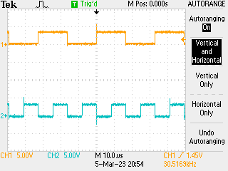

# Very basic Verilog

Start at the very bottom -> did not get on well with the clicky stuff. Simple task: implement a counter to blink some lights / drive some GPIO into a scope.

## Hardware

Many parts to hardware, want to use JE output (mapped to 8-bit) and basic `sysclk` which in this board runs at 125 MHz (which feels ... familiar). Job: take clock and step it down enought to have a four bit counter on LEDs you can actually read. Bonus points: include the switches to enable or disable LEDs.

## Code

Actually starts off with the constraints for the board, which is writtel in `tcl`:

```tcl
# system clock

set_property -dict { PACKAGE_PIN K17   IOSTANDARD LVCMOS33 } [get_ports { sysclk }]; #IO_L12P_T1_MRCC_35 Sch=sysclk
create_clock -add -name sys_clk_pin -period 8.00 -waveform {0 4} [get_ports { sysclk }];

# switches

set_property -dict { PACKAGE_PIN G15   IOSTANDARD LVCMOS33 } [get_ports { sw[0] }]; #IO_L19N_T3_VREF_35 Sch=sw[0]
set_property -dict { PACKAGE_PIN P15   IOSTANDARD LVCMOS33 } [get_ports { sw[1] }]; #IO_L24P_T3_34 Sch=sw[1]
set_property -dict { PACKAGE_PIN W13   IOSTANDARD LVCMOS33 } [get_ports { sw[2] }]; #IO_L4N_T0_34 Sch=sw[2]
set_property -dict { PACKAGE_PIN T16   IOSTANDARD LVCMOS33 } [get_ports { sw[3] }]; #IO_L9P_T1_DQS_34 Sch=sw[3]

# LED output ports

set_property -dict { PACKAGE_PIN M14   IOSTANDARD LVCMOS33 } [get_ports { led[0] }]; #IO_L23P_T3_35 Sch=led[0]
set_property -dict { PACKAGE_PIN M15   IOSTANDARD LVCMOS33 } [get_ports { led[1] }]; #IO_L23N_T3_35 Sch=led[1]
set_property -dict { PACKAGE_PIN G14   IOSTANDARD LVCMOS33 } [get_ports { led[2] }]; #IO_0_35 Sch=led[2]
set_property -dict { PACKAGE_PIN D18   IOSTANDARD LVCMOS33 } [get_ports { led[3] }]; #IO_L3N_T0_DQS_AD1N_35 Sch=led[3]

# JE output port

set_property -dict { PACKAGE_PIN V12   IOSTANDARD LVCMOS33 } [get_ports { je[0] }]; #IO_L4P_T0_34 Sch=je[1]
set_property -dict { PACKAGE_PIN W16   IOSTANDARD LVCMOS33 } [get_ports { je[1] }]; #IO_L18N_T2_34 Sch=je[2]
set_property -dict { PACKAGE_PIN J15   IOSTANDARD LVCMOS33 } [get_ports { je[2] }]; #IO_25_35 Sch=je[3]
set_property -dict { PACKAGE_PIN H15   IOSTANDARD LVCMOS33 } [get_ports { je[3] }]; #IO_L19P_T3_35 Sch=je[4]
set_property -dict { PACKAGE_PIN V13   IOSTANDARD LVCMOS33 } [get_ports { je[4] }]; #IO_L3N_T0_DQS_34 Sch=je[7]
set_property -dict { PACKAGE_PIN U17   IOSTANDARD LVCMOS33 } [get_ports { je[5] }]; #IO_L9N_T1_DQS_34 Sch=je[8]
set_property -dict { PACKAGE_PIN T17   IOSTANDARD LVCMOS33 } [get_ports { je[6] }]; #IO_L20P_T3_34 Sch=je[9]
set_property -dict { PACKAGE_PIN Y17   IOSTANDARD LVCMOS33 } [get_ports { je[7] }]; #IO_L7N_T1_34 Sch=je[10]
```

Given this the program is almost trivial:

```verilog
`timescale 1ns / 1ps

// removed comment block

module blinky(
    input sysclk,
    input [3:0] sw,
    output [3:0] led,
    output [7:0] je
    );
    reg[27:0] count = 0;
    assign led = count[27:24] & sw;
    assign je = count[17:10];
    always @ (posedge(sysclk)) count <= count + 1;
endmodule
```

This then counts the LEDs as bits 27-24 iff the switches allow, and then 17-10 on the GPIO so you can hook up a 'scope:



Happy there...
