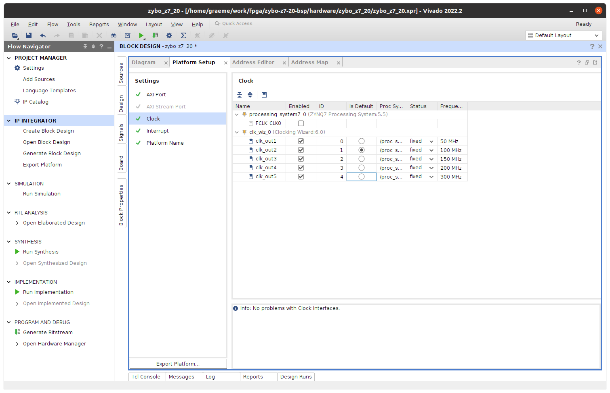

# Zybo Z7-20 Board Support Package

Build a BSP for the Zybo Z7-20 to allow `petalinux` base with accelerated code running on the FPGA...

## Hardware definition

Start with

```bash
mkdir zybo-z7-20-bsp
cd zybo-z7-20-bsp
mkdir hardware software platform
cd hardware
vivado
```

Much drawing of boxes and lines -> really want to know what the Verilog equivalent of this is, would probably make a lot more sense... anyway, we need to make a new project inside the hardware, say `zybo_z7_20`. No sources, right now, and it will be an extensible platform. Base it on a Zybo Z7-20 board, which may need a download of the board definition files.

Now we have a lot of block design work. Create block design -> whatever you like as name, local to project. We are here:


Big plus to add things from the board definitions we loaded earlier, first the ZYNQ7 processing system (PS). Blue link at the top to "run automation" -> this. Leave as is, go.


### Clocks


Again + -> clocking wizard -> double click the product then add 5 x output clocks at 50, 100, 150, 200, 300 MHz (I really don't know if we need all of these.) - also "reset low". Then we hook up 5 x "processor system reset" to these 5 clocks... you can arrange things however you like if you get the connections right. At this point it is probably useful to fullscreen that window.

```
clk_out1 -> slowest_sync_clk on proc_sys_reset0
```

etc. then join all the `ext_reset_in` together to `FCLK_RESET` on the zynq, and a couple of other connections:


### Interrupts

Double click zynq, go to interrupts, and enable `IRQ_F2P` which links fabric interrupts to the processor system:


We then need to add an AXI interrupt controller (AXI is the central bus system I think?) and set the output connection to single. I need to work out _why_ this is the case...


Now we can finally "run connection automation" accepting the defaults. More little boxes appear on the map. At this stage connect the AXI irq output to CPU in irq:


### Platform Setup

Window -> platform setup, lots of enabling:


Note well: SP Tag here is _not_ available in the pull-down - you type it in. TODO figure out the detail of what we are connecting here, and why. Also enable `M01_AXI` to `M31_AXI` ports (why only 31?):


Now go edit clocks (see red bubble) - enable all 5 then set 100 MHz clock as default, and update IDs to count from 0. The bubble turns into a green tick:



Then in the interrupt menu, enable `axi_intc_0`.

Now un-full-screen the block diagram, select zynq and edit properties (block properties panel) and modify `SELECT_SIM_MODEL` to `tlm`. TODO work out why `rtl` is wrong.

### Generate Bitstream

Save, then Sources panel -> right click, generate output products.


Assuming all the defaults are good here:


Computer will make whirring noise for a spell... 