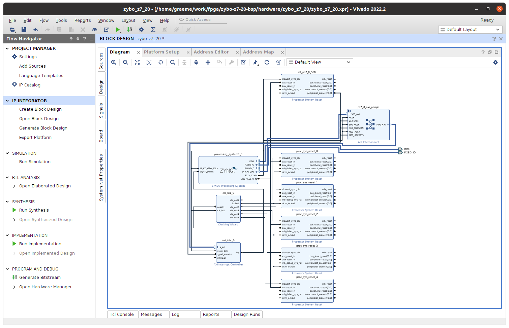

# Zybo Z7-20 Board Support Package

Build a BSP for the Zybo Z7-20 to allow `petalinux` base with accelerated code running on the FPGA...

## Hardware definition

Start with

```bash
mkdir zybo-z7-20-bsp
cd zybo-z7-20-bsp
mkdir hardware software platform
cd hardware
vivado
```

Much drawing of boxes and lines -> really want to know what the Verilog equivalent of this is, would probably make a lot more sense... anyway, we need to make a new project inside the hardware, say `zybo_z7_20`. No sources, right now, and it will be an extensible platform. Base it on a Zybo Z7-20 board, which may need a download of the board definition files, for which you hit "refresh" which will pull things from somewhere with `git`.

Now we have a lot of block design work. Create block design -> whatever you like as name, local to project. We are here:


Big plus to add things from the board definitions we loaded earlier, first the ZYNQ7 processing system (PS). Blue link at the top to "run automation" -> this. Leave as is, go.


### Clocks


Again + -> clocking wizard -> double click the product then add 5 x output clocks at 50, 100, 150, 200, 300 MHz (I really don't know if we need all of these.) - also "reset low". Then we hook up 5 x "processor system reset" to these 5 clocks... you can arrange things however you like if you get the connections right. At this point it is probably useful to fullscreen that window.

```
clk_out1 -> slowest_sync_clk on proc_sys_reset0
```

etc. then join all the `ext_reset_in` together to `FCLK_RESET` on the zynq, and a couple of other connections:


### Interrupts

Double click zynq, go to interrupts, and enable `IRQ_F2P` which links fabric interrupts to the processor system:


We then need to add an AXI interrupt controller (AXI is the central bus system I think?) and set the output connection to single. I need to work out _why_ this is the case...


Now we can finally "run connection automation" accepting the defaults. More little boxes appear on the map. At this stage connect the AXI irq output to CPU in irq:



### Platform Setup

Window -> platform setup, lots of enabling:


Note well: SP Tag here is _not_ available in the pull-down - you type it in. This is fine because they can be selected by the `v++` configuration during the linking phase. TODO figure out the detail of what we are connecting here, and why. Also enable `M01_AXI` to `M31_AXI` ports (why only 31?):


Now go edit clocks (see red bubble) - enable all 5 then set 100 MHz clock as default, and update IDs to count from 0. The bubble turns into a green tick:


Then in the interrupt menu, enable `axi_intc_0`.

Now un-full-screen the block diagram, select zynq and edit properties (block properties panel) and modify `SELECT_SIM_MODEL` to `tlm`. TODO work out why `rtl` is wrong.

### Generate Bitstream

Save, then Sources panel -> right click, generate output products.


Assuming all the defaults are good here:


Computer will make whirring noise for a spell... then a wall of "critical warnings" that one can safely ignore... again should check those.

```
[BD 41-759] The input pins (listed below) are either not connected or do not have a source port, and they don't have a tie-off specified. These pins are tied-off to all 0's to avoid error in Implementation flow.
Please check your design and connect them as needed: 
/axi_intc_0/intr
```

OK, based on [this](https://xilinx.github.io/Vitis-Tutorials/2022-1/build/html/docs/Vitis_Platform_Creation/Design_Tutorials/01-Edge-KV260/step1.html) it seems that this is fine because "Note: During validation, Vivado reports a critical warning that /axi_intc_0/intr is not connected. This warning can be safely ignored because v++ linker will link kernel interrupt signals to this floating intr signal."

Feels like it deserves some attention. Come back to it. The rest are about clock skew which is ... OK? Then right click -> create HDL wrapper -> defaults and OK. Then generate bitstream once everything ready. Lots of dependent tasks for this, which is fine. More whirring now, go and put the kettle on.

When completed, open design just for fun:


We are not using a lot of the silicon here, which is good as we want that for the actual application. Now file -> export -> export platform / hardware and emulation -> pre-synth and include bitstream, chose a sensible name. 


At this point we are done in Vivado, and we have a hardware platform. Next to build Linux for this. Close Vivado. Product of our work:

```
graeme@sleeper-service:~/work/fpga/zybo-z7-20-bsp/hardware$ ls -l zybo_z7_20/zybo_z7_20_wrapper.xsa 
-rw-rw-r-- 1 graeme graeme 18221032 Mar 15 05:42 zybo_z7_20/zybo_z7_20_wrapper.xsa
```

## Linux Setup

This is all command-line now. Move to `software` directory. Source the set-up file:

```
graeme@sleeper-service:~/work/fpga/zybo-z7-20-bsp/software$ . ~/xilinx/PetaLinux/2022.2/tool/settings.sh 
PetaLinux environment set to '/home/graeme/xilinx/PetaLinux/2022.2/tool'
WARNING: /bin/sh is not bash! 
bash is PetaLinux recommended shell. Please set your default shell to bash.
WARNING: This is not a supported OS
INFO: Checking free disk space
INFO: Checking installed tools
INFO: Checking installed development libraries
INFO: Checking network and other services
WARNING: No tftp server found - please refer to "UG1144 2022.2 PetaLinux Tools Documentation Reference Guide" for its impact and solution
```

You may need to play `apt install` whak-a-mole now.

### Basic Project

On safer ground here, this is like building and configuring Linux in the '90's.

```
$ petalinux-create -t project --template zynq -n zybo_z7_20_linux
$ cd zybo_z7_20_linux/
$ petalinux-config --get-hw-description=../../hardware/zybo_z7_20/
```

much activity follows... and then an ancient terminal menu setup. Accept defaults, continue. More activity follows, then a bunch more open configuration tool, accept defaults, continue:

```
$ petalinux-config -c kernel
```

N.B. this does a lot of things before showing you a menu, be patient.

### Configure Root Filesystem

This adds some things we may want to the root file system - TODO figure out what each of these are (some are related to openCL).

```
vi ./project-spec/meta-user/conf/user-rootfsconfig
```

add

```
CONFIG_xrt
CONFIG_xrt-dev
CONFIG_zocl
CONFIG_opencl-clhpp-dev
CONFIG_opencl-headers-dev
CONFIG_packagegroup-petalinux-opencv
```

Then

```
petalinux-config -c rootfs
```

and when the menu appears, select all the user stuff e.g. 

```
  │ │                        [*] gpio-demo                     │ │  
  │ │                        [*] opencl-clhpp-dev              │ │  
  │ │                        [*] opencl-headers-dev            │ │  
  │ │                        [*] packagegroup-petalinux-opencv │ │  
  │ │                        [*] peekpoke                      │ │  
  │ │                        [*] xrt                           │ │  
  │ │                        [*] xrt-dev                       │ │  
  │ │                        [*] zocl     
```

Then save, exit, and

```
petalinux-build
```

again, this will take a while. Then,

```
petalinux-build --sdk
```

then

```
cd images/linux
./sdk.sh
```

Which will ask you for an installation directory - I chose `platform` at the very start:

```
PetaLinux SDK installer version 2022.2
======================================
Enter target directory for SDK (default: /opt/petalinux/2022.2): /home/graeme/work/fpga/zybo-z7-20-bsp/platform
You are about to install the SDK to "/home/graeme/work/fpga/zybo-z7-20-bsp/platform". Proceed [Y/n]? 
Extracting SDK...........................................................................................................................................................done
Setting it up...done
SDK has been successfully set up and is ready to be used.
Each time you wish to use the SDK in a new shell session, you need to source the environment setup script e.g.
 $ . /home/graeme/work/fpga/zybo-z7-20-bsp/platform/environment-setup-cortexa9t2hf-neon-xilinx-linux-gnueabi
```

Stuff happens, then it says about using the SDK later -> source this file

The script I am following to do this tells me to stash a bunch of files. I ignored what it sayd about `boot.scr` and just use the one which is here and it all seems OK

```
$ mkdir ../../../boot
$ cp image.ub rootfs.cpio u-boot.elf zynq_fsbl.elf system.dtb boot.scr ../../../boot/
```

Change to `../../../boot` and make a file `linix.bif` which has a bunch of pointers in:

```
graeme@limiting-factor:~/work/fpga/zybo-z7-20-bsp/software/boot$ cat linux.bif 
the_ROM_image:
{
[bootloader]</home/graeme/work/fpga/zybo-z7-20-bsp/software/boot/zynq_fsbl.elf>
<bitstream>
<uboot,/home/graeme/work/fpga/zybo-z7-20-bsp/software/boot/u-boot.elf>
[load=0x00100000] <dtb,/home/graeme/work/fpga/zybo-z7-20-bsp/software/boot/system.dtb>
}
```

In my case. Then another file `qemu_args.txt` which I think are used for simulation...

```
-M
arm-generic-fdt-7series
-serial
/dev/null
-serial
mon:stdio
-device
loader,addr=0xf8000008,data=0xDF0D,data-len=4
-device
loader,addr=0xf8000140,data=0x00500801,data-len=4
-device
loader,addr=0xf800012c,data=0x1ed044d,data-len=4
-device
loader,addr=0xf8000108,data=0x0001e008,data-len=4
-device
loader,addr=0xF800025C,data=0x00000005,data-len=4
-device
loader,addr=0xF8000240,data=0x00000000,data-len=4
-boot
mode=5
-device
loader,addr=0x100000,file=</home/graeme/work/fpga/zybo-z7-20-bsp/software/boot/system.dtb>
-kernel
</home/graeme/work/fpga/zybo-z7-20-bsp/software/boot/u-boot.elf>
-machine
linux=on
```

Important note - the original for this included the words `qemu` which I don't have as a directory... so this was probably never actually used when I worked through all this.

The interesting bit comes now...

## Use the Platform

https://xilinx.github.io/XRT/master/html/build.html

