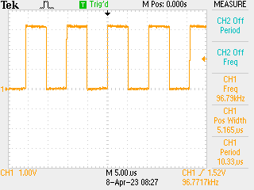

# Fast triggering LED with DMA

Exercise in figuring out DMA chaining, turns out the terminology for this is a transaction in the local lingo. With code below LED flickered at about 10MHz so the DMA transfers running at about 20MHz, well in excess of what is needed to run 2 x DAC flat out.

Details:

- `0x41008000` is PORT address
- `0x41008000 | 0x80` is PORT B
- `0x41008000 | 0x80 | 0x1c` is pin PORT B TOGGLE register
- LED is on `PB01/D13` -> sent 0x2 to PORT B TOGGLE to switch

```python
# Blink the LED with DMA
#
# i.e. write the correct bit to the TGL register a few million times
# N.B. will involve DMA chaining and DMA enable / disable. LED on pin 2
# of B port

from machine import mem32, Pin
from uctypes import addressof

import time

led = Pin("D13", Pin.OUT)

buffer = bytearray(4)
address = addressof(buffer)
mem32[address] = 0x2

# get the DMA configured
DMAC_BASE = 0x4100A000

# SWRST of DMA controller
mem32[DMAC_BASE] = 0x1

# allocate part of the SRAM for DMAC working memory - each DMAC needs
# 4 words, and in the examples I looked at they needed to be 16-byte
# aligned but I have no idea if this is important - it turns out it
# probably is, so should allocate extra space? N.B. only need the 
# space from CHANNEL 0 ... N so if N == 0 could use a lot less space.
# By happy accident this _always_ appears to be 128 bit aligned.
dma_bfr = bytearray(2 * 16)

DESC_BASE = addressof(dma_bfr)
DWRB_BASE = addressof(dma_bfr) + 16

mem32[DMAC_BASE | 0x34] = DESC_BASE
mem32[DMAC_BASE | 0x38] = DWRB_BASE

# start actual DMA configuration - enable 0x2 and all priority?
mem32[DMAC_BASE | 0x0] = (0xf << 8) | 0x2

# select channel 0 - configure as transaction i.e. will send everything
# once the trigger arrives, and keep sending until the DMA chain expires
mem32[DMAC_BASE | 0x40] = 0x3 << 20

# channel zero configuration NN in top half, do not increment the source pointer
# or destination pointer and move 4 bytes, chain to #0 i.e. self
mem32[DESC_BASE] = (10000 << 16) | (0x2 << 8) | 0x1
mem32[DESC_BASE | 0x4] = address
mem32[DESC_BASE | 0x8] = 0x41008000 | 0x80 | 0x1c
mem32[DESC_BASE | 0xc] = DESC_BASE

# enable
mem32[DMAC_BASE | 0x40] |= 0x2

# trigger
mem32[DMAC_BASE | 0x10] = 0x1

# should run for a while
time.sleep(60)

# disable
mem32[DMAC_BASE | 0x40] &= 0xfffffffc
mem32[DMAC_BASE | 0x0] = 0x0

led.off()
```

## Chaining to Different Descriptor

Variation on the theme - make a data array of `0x2` followed by 99 `0x0`'s and then use channels 0, 1 for the DMA -> can get an assessment of the impact of the change over from block 0 to 1 or vice versa (N.B. 0 to 0 also non-instant).

```python
from machine import mem32, Pin
from uctypes import addressof

import time

led = Pin("D13", Pin.OUT)

buffer = bytearray(400)
address = addressof(buffer)
for j in range(100):
    if (j % 100):
        mem32[address + 4 * j] = 0x0
    else:
        mem32[address + 4 * j] = 0x2

DMAC_BASE = 0x4100A000

mem32[DMAC_BASE] = 0x1

# two channels, source and write back (though these probably could point 
# at the same place)
dma_bfr = bytearray(4 * 16)

DESC_BASE = addressof(dma_bfr)
DWRB_BASE = addressof(dma_bfr) + 32

mem32[DMAC_BASE | 0x34] = DESC_BASE
mem32[DMAC_BASE | 0x38] = DWRB_BASE

# start actual DMA configuration - enable 0x2 and all priority?
mem32[DMAC_BASE | 0x0] = (0xf << 8) | 0x2

# select channel 0 - configure as transaction i.e. will send everything
# once the trigger arrives, and keep sending until the DMA chain expires
mem32[DMAC_BASE | 0x40] = 0x3 << 20

# channel zero configuration NN in top half, do increment the source pointer
# or destination pointer and move 4 bytes, chain to #1
mem32[DESC_BASE] = (100 << 16) | (0x1 << 10) | (0x2 << 8) | 0x1
mem32[DESC_BASE | 0x4] = address + 4 * 100
mem32[DESC_BASE | 0x8] = 0x41008000 | 0x80 | 0x1c
mem32[DESC_BASE | 0xc] = DESC_BASE

# as above, chained to #0
mem32[DESC_BASE | 0x10] = (100 << 16) | (0x1 << 10) | (0x2 << 8) | 0x1
mem32[DESC_BASE | 0x14] = address + 4 * 100
mem32[DESC_BASE | 0x18] = 0x41008000 | 0x80 | 0x1c
mem32[DESC_BASE | 0x1c] = DESC_BASE

# enable both
mem32[DMAC_BASE | 0x40] |= 0x2
mem32[DMAC_BASE | 0x50] |= 0x2

# trigger #1
mem32[DMAC_BASE | 0x10] = 0x1

# should run for a while
time.sleep(60)

# disable
mem32[DMAC_BASE | 0x40] &= 0xfffffffc
mem32[DMAC_BASE | 0x50] &= 0xfffffffc
mem32[DMAC_BASE | 0x0] = 0x0

led.off()
```

This has the result of:



All things being equal this should be ~ 100kHz so there is some overhead in the switch. Measuring it fairly easy but not done yet, just infer from this the following:

_Do not use DMA pacing as a primary clock for real time work_

Instead rely e.g. on a "proper" clock and drive the DMA from outside. Almost certainly good for reliable ~ 1MHz operation.
