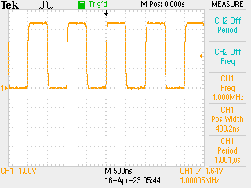

# Clocks Again

Working through some more what the clocks are good for, now trying to see what the output looks like and how I can use this as input to the DAC / DMA (which is what I was actually trying to achieve.) The basic idea is very simple here - create a general clock connected to one of the main clock sources, then connect that to a peripheral (TCC1, in my case) which allows connection to the LED at D13 / PA22. N.B. the connections on the outside ATSAMD51G19A are very limited, and not many offer function M which is `GCLK_IO` output from a "useful" clock.

## Code

Goal: hook up output to LED / GPIO such that oscilloscope trace is reachable, at some fixed divider:

```python
from machine import mem32, mem8

# base addresses
MCLK_BASE = 0x40000800
GCLK_BASE = 0x40001C00
PORT_BASE = 0x41008000
TCC1_BASE = 0x41018000

# set up LED on D13 / PA22 connected to TCC1 which is mode F (i.e. 5)
# and set the PMUX bit - since not going through PORT register do not
# need to consider in / out etc.
mem8[PORT_BASE | 0x40 | 22] = 1
mem8[PORT_BASE | 0x30 | 11] = 5

# hook up 48 MHz clock
mem32[GCLK_BASE | 0x80 | 100] = (0x1 << 6) | 0x4
mem32[GCLK_BASE | 0x20 | 16] = (0x1 << 16) | (0x1 << 8) | 0x6

# configure TCC1
mem32[MCLK_BASE | 0x18] |= 0x1 << 12
mem32[TCC1_BASE | 0x3C] = 2
mem32[TCC1_BASE | 0x40] = 47
mem32[TCC1_BASE | 0x4C] = 24

mem32[TCC1_BASE] = 0x2
```

This configures clock #4 (which I found is not usually configured) at 48MHz connected off source 6 which seems pretty universal, then sets TCCO to count `0...47` inclusive before overflow. Result on D13:



Which looks like what I wanted. No crystal on this board to there is a little frequency drift...
