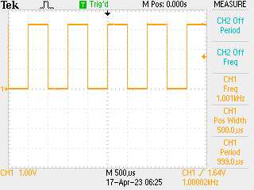

# Driving DMA with a Clock

One of my main goals is to try driving the DMA at 1MHz (or the DAC) to get an analogue signal out. Examples from Arduino use this to clock the DMA, using a counter to step down the clock speed -> let's start there and make that work.

## Materials

Set up D13 / PA22 (on ItsyBitsy) as PORT controlled output, DMA array with 1,000 elements where the first is toggling PA22 and the rest are NULL, clock 4 again at 1MHz -> should toggle ever 1,000µs thus giving a 500Hz square wave output.

## Code

Much register bashing:

```python
# Blink the LED with DMA
#
# i.e. write the correct bit to the TGL register a few million times
# N.B. will involve DMA chaining and DMA enable / disable.

from uctypes import addressof
from machine import mem32, mem8
import time

# base addresses
MCLK_BASE = 0x40000800
GCLK_BASE = 0x40001C00
PORT_BASE = 0x41008000
DMAC_BASE = 0x4100A000
TCC1_BASE = 0x41018000

# set up LED - D13 => PA22
mem32[PORT_BASE | 0x8] = 0x1 << 22
mem32[PORT_BASE | 0x1C] = 0x1 << 22

# hook up 48 MHz clock
mem32[GCLK_BASE | 0x80 | 100] = (0x1 << 6) | 0x4
mem32[GCLK_BASE | 0x20 | 16] = (0x1 << 16) | (0x1 << 8) | 0x6

# configure TCC1 - we don't much care about the CC value, only the overflow
# (though we could trigger off CC and use this to measure?)
mem32[MCLK_BASE | 0x18] |= 0x1 << 12
mem32[TCC1_BASE | 0x3C] = 2
mem32[TCC1_BASE | 0x40] = 47
mem32[TCC1_BASE | 0x4C] = 24

# configure data buffer and DMA
NN = 1000

buffer = bytearray(4 * NN)
address = addressof(buffer)
for j in range(NN):
    if j % NN:
        mem32[address + 4 * j] = 0x0
    else:
        mem32[address + 4 * j] = 0x1 << 22

# get the DMA configured - depends on timer counter and global clock

# allocate part of the SRAM for DMAC working memory - each DMAC needs
# 4 words, and in the examples I looked at they needed to be 16-byte
# aligned but I have no idea if this is important - it turns out it
# probably is, so allocate extra space
dma_bfr = bytearray(2 * 16)

DESC_BASE = addressof(dma_bfr)
DWRB_BASE = addressof(dma_bfr) + 16

mem32[DMAC_BASE | 0x34] = DESC_BASE
mem32[DMAC_BASE | 0x38] = DWRB_BASE

# start actual DMA configuration - enable 0x2 and all priority?
mem32[DMAC_BASE | 0x0] = (0xF << 8) | 0x2

# select channel 0 - configure as burst with size = 1 triggered
# TCC1 OVF - chain will ensure that this keeps rolling
mem32[DMAC_BASE | 0x40] = (0x2 << 20) | (0x1D << 8)

# channel zero configuration NN in top half, do increment the source pointer
# or destination pointer and move 4 bytes, chain to #0
mem32[DESC_BASE] = (NN << 16) | (0x1 << 10) | (0x2 << 8) | 0x1
mem32[DESC_BASE | 0x4] = address + 4 * NN
mem32[DESC_BASE | 0x8] = 0x41008000 | 0x1C
mem32[DESC_BASE | 0xC] = DESC_BASE

# enable
mem32[DMAC_BASE | 0x40] |= 0x2

# trigger by enabling TCC1
mem32[TCC1_BASE] = 0x2

# should run for a while
time.sleep(60)

# disable
mem32[TCC1_BASE] = 0x0
mem32[DMAC_BASE | 0x40] &= 0xFFFFFFFC
mem32[DMAC_BASE | 0x0] = 0x0

mem32[PORT_BASE | 0x14] = 0x1 << 22
```

Seems to do what I wanted though - see 500Hz square wave on the 'scope. Can now use this to probe how much the DMA channel restart costs... setting the on / off points to the first and middle word in the array should be enough to probe this well. With

```python
NN = 1000

buffer = bytearray(4 * NN)
address = addressof(buffer)
for j in range(NN):
    if j % 500:
        mem32[address + 4 * j] = 0x0
    else:
        mem32[address + 4 * j] = 0x1 << 22
```

Get a pretty tidy square wave -> it'll do, probably:


