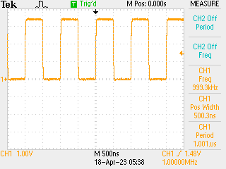

# Really Basic Clock

You can connect any GLCK to a GPIO via `gclk_io` provided that it is routed out of the CPU package and connected to an actual pin - which is a problem for ItsyBitsy so break out Grand Central which uses the 128 pin package...

Send GCLK4 with divider 120 -> D8:

```python
from machine import mem32, mem8

# base addresses
GCLK_BASE = 0x40001C00
PORT_BASE = 0x41008000 | 0x80

# PB18 can be hooked up to GCLK 4, which is usually unused. Hook this to SRC7
# which is 120 MHz...
mem8[PORT_BASE | 0x40 | 18] = 1
mem8[PORT_BASE | 0x30 | 9] = 0xc

# hook up 120 MHz clock, with divider 120
mem32[GCLK_BASE | 0x20 | 16] = (120 << 16) | (0x1 << 11) | (0x1 << 8) | 0x7
```



Setting the clock divider to 1 not 120 gives a 120 MHz sine wave - can't get the signal out well...
