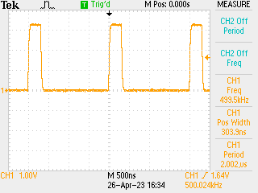

# Adding IRQ Handlers in C

Following on from the question of "how long to µPython interrupts take" (around 15µs) the question came about can I add proper low-level C interrupts without changing the micropython source code? Answer: obviously no, because the interrupt vector table is stored in flash.

Less obvious answer, yes, you can, but it is a bit like changing the tyres on the car while you are driving along the highway at the speed limit. Here's how I did it. Clue: much reading of data sheets was involved.

## Interrupts in M4

M4 IRQ handlers are in a vector which is pointed at by the `VTOR` register - at boot this points to `0x4000` which is just inside the flash code, and consists of 16 registers belonging to ARM before the 138 registers for the IRQ handler (on SAMD51). The EIC registers for the external interrupt controller start at position 12 and count for a further 16 - I want to overwrite one of these with my own handler code.

## Wiring

Use D13 as output and an indicator of what is going on. Setting up D12 as input using the usual `machine.Pin` and `pin.irq()` shuffle, because (this is the cunning bit) _I will just overwrite the IRQ function pointer_. To make this work, need jumper from D12 to D13 (PA23->PA22 in AMTEL-speak).

## Code

This is a long one. Mostly C:

```c
#include "py/dynruntime.h"

// defines
#define EIC_BASE 0x40002800
#define VTOR_ADDR 0xe000ed08
#define PORT_BASE 0x41008000

// memory structure - interrupt vector is length > 128 words -> 256 word alignment
// needed so just allocate 2 kB of memory, seek to point where this is aligned
// correctly

unsigned int *buffer = NULL;
unsigned int *irq_vector_copy = NULL;
unsigned int *VTOR_INIT = 0;

void irq_action(void) {
  // clear PA22
  *((unsigned int *) (PORT_BASE | 0x14)) = 0x1 << 22;

  // clear IRQ
  *(unsigned int *) (EIC_BASE | 0x14) = 0x1 << 7;
}

STATIC mp_obj_t drive_irq_init(void) {
  // allocate buffer of 2 x size to give space to align with 1024 kB boundary
  if (buffer == NULL) {
    buffer = m_malloc(2 * 1024);
    irq_vector_copy = (unsigned int *)(((unsigned int)buffer & (~1023)) + 1024);

    VTOR_INIT  = *(unsigned int **)VTOR_ADDR;

    // Copy vector from current source location
    for (int j = 0; j < (16 + 138); j++) {
      irq_vector_copy[j] = VTOR_INIT[j];
    }

    // Register additional handler - for PA22 is on EIC7
    irq_vector_copy[12 + 16 + 7] = (unsigned int) &irq_action;

    // Update VTOR
    *(unsigned int **)VTOR_ADDR = irq_vector_copy;

  }

  mp_int_t result = (mp_int_t)VTOR_INIT;
  return mp_obj_new_int(result);
}

STATIC mp_obj_t drive_irq_deinit(void) {
  if (buffer) {
    // Revert VTOR
    *(unsigned int **)VTOR_ADDR = VTOR_INIT;

    m_free(buffer);
    buffer = NULL;
    irq_vector_copy = NULL;
  }

  mp_int_t result = (mp_int_t)irq_vector_copy;
  return mp_obj_new_int(result);
}

STATIC MP_DEFINE_CONST_FUN_OBJ_0(drive_irq_init_obj, drive_irq_init);
STATIC MP_DEFINE_CONST_FUN_OBJ_0(drive_irq_deinit_obj, drive_irq_deinit);

mp_obj_t mpy_init(mp_obj_fun_bc_t *self, size_t n_args, size_t n_kw,
                  mp_obj_t *args) {
  MP_DYNRUNTIME_INIT_ENTRY

  mp_store_global(MP_QSTR_init, MP_OBJ_FROM_PTR(&drive_irq_init_obj));
  mp_store_global(MP_QSTR_deinit, MP_OBJ_FROM_PTR(&drive_irq_deinit_obj));

  MP_DYNRUNTIME_INIT_EXIT
}
```

On `drive_irq.init()` this copies and rewrites the IRQ vector to another place in RAM, rewrites EIC#7 and then updates the VTOR register. `drive_irq.deinit()` undoes this. The IRQ function just writes a clear bit to the right bit in the PORT register for D13 / PA22.

## Results

Remembering that the µPython version took ~ 15µs, this is _much_ better:



However that is _not good enough_ because (i) ~300ns feels like a long time (40 ticks?) and (ii) there is a _lot_ of jitter on that time, seems to vary quite a lot when the CPU should really not be doing anything but `time.sleep()`. That said, the IRQ handler will also be dealing with USB ping packets etc. at ~ 1kHz too, and I am running it at 1,000,000 interrupts / second which is probably a bit unsporting.

The assembly for the `irq_action` code looks exactly what I would write -

```assembly
00000000 <irq_action>:
   0:	4b04      	ldr	r3, [pc, #16]	; (14 <irq_action+0x14>)
   2:	f44f 0280 	mov.w	r2, #4194304	; 0x400000
   6:	615a      	str	r2, [r3, #20]
   8:	4b03      	ldr	r3, [pc, #12]	; (18 <irq_action+0x18>)
   a:	2280      	movs	r2, #128	; 0x80
   c:	f8c3 2814 	str.w	r2, [r3, #2068]	; 0x814
  10:	4770      	bx	lr
  12:	bf00      	nop
  14:	41008000 	mrsmi	r8, (UNDEF: 0)
  18:	40002000 	andmi	r2, r0, r0
```

So I am not sure where all those cycles are going (the two last records are address records.) Book says the interrupt should take 12 ticks to trigger, this is about another 6 before the bit meets the register so 🤷‍♂️ - answers on a postcard welcome.
