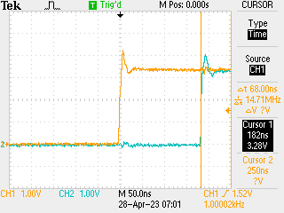

# Drive-by IRQ Installation in MicroPython on rp2040

Got the drive-by IRQ vector overwrite working fine on SAMD51, though was not 100% happy because the timing was super jittery (+/- 20-30ns) and somewhat slow (> 300ns). I have had more steady reports from rp2040 in the past with C-coded (i.e. no µPython involvement) IRQ handlers so port this back to rp2040.

Turns out that is much simpler as the IRQ vector table is actually at the start of RAM already for the rp2040 port rather than in the flash - no idea why - so all I need to do is rewrite the pointer on `init()` and restore the pointer on `deinit()`.

## Implementation

Set a clock pointing at GPIO21 off main clock (125MHz) with 125,000 divider -> 1kHz ticks. All of this done by register poking in µPython as that is an easy way to get the job done. Set up IRQ off rising and falling edge on GPIO19, triggering a toggle of GPIO20 through the medium of a direct write to the `IO_PORT` register with the right bit set.

Ergo, one may set up a 'scope pointing with channel 0 for the timing on GPIO21, then channel 1 pointing at GPIO20 to get an idea of the latency. Requires jumper wire from GPIO21 to GPIO19.

## Code

Set up system in µPython:

```python
from machine import mem32, Pin

p20 = Pin(20, Pin.OUT)

def toggle(pin):
    p20.toggle()

# toggle once so that the graphs are in phase
toggle()

p19 = Pin(19, Pin.IN)

IO_BANK_BASE = 0x40014000
CLK_BASE = 0x40008000
GPIO21_CTRL = IO_BANK_BASE | 0xAC

mem32[GPIO21_CTRL] = 8  # GPCLK0
mem32[CLK_BASE] = 1 << 11

mem32[CLK_BASE | 4] = 125000 << 8

p19.irq(toggle, Pin.IRQ_RISING | Pin.IRQ_FALLING, hard=True)
```

This is enough to get an idea of the baseline time for a µPython implemented IRQ handler (hint: around 21µs i.e. an age of mankind). This also sets up the registers etc. correctly such that the IRQ _will_ be called on rising and falling edges, which is much of the work. So what we need to do in the replacement implementation is overwrite the vector entry, then have the IRQ function (i) toggle the right bit and (ii) reset the IRQ bits:

```c
#include "py/dynruntime.h"

unsigned int original_handler;
unsigned int original_handler_set;

#define VTOR_ADDR 0xe000ed08

void irq(void) {
  // toggle GPIO 20
  *(unsigned int *)0xd000001c = 0x1 << 20;
  // clear IRQ @ 19
  *(unsigned int *)0x400140f8 = 0xf << 12;
}

STATIC mp_obj_t irq_init(void) {
  if (original_handler_set == 0) {
    unsigned int *VTOR = *(unsigned int **)VTOR_ADDR;
    original_handler = VTOR[16 + 13];
    VTOR[16 + 13] = (unsigned int)&irq;
    original_handler_set = 1;
  }
  return mp_obj_new_int(0);
}

STATIC mp_obj_t irq_deinit(void) {
  if (original_handler_set == 1) {
    unsigned int *VTOR = *(unsigned int **)VTOR_ADDR;
    VTOR[16 + 13] = original_handler;
    original_handler_set = 0;
  }
  return mp_obj_new_int(0);
}

STATIC MP_DEFINE_CONST_FUN_OBJ_0(irq_init_obj, irq_init);
STATIC MP_DEFINE_CONST_FUN_OBJ_0(irq_deinit_obj, irq_deinit);

mp_obj_t mpy_init(mp_obj_fun_bc_t *self, size_t n_args, size_t n_kw,
                  mp_obj_t *args) {
  MP_DYNRUNTIME_INIT_ENTRY

  original_handler_set = 0;

  mp_store_global(MP_QSTR_init, MP_OBJ_FROM_PTR(&irq_init_obj));
  mp_store_global(MP_QSTR_deinit, MP_OBJ_FROM_PTR(&irq_deinit_obj));

  MP_DYNRUNTIME_INIT_EXIT
}
```

This turns out to be reasonably simple then. Usage simply involves:

```python
import irq
irq.init()
```

which replaces the IRQ handler. Key point: rp2040 is based on Cortex M0+ not M4F so we need to be sure to compile this for ARMv6 architecture:

```
MOD = irq
SRC = irq.c

# ideally this should come from invocation?
ARCH = armv6m

# the actual Makefile code
include ../mpy.mk
```

in makefile...

## Results

These are quite satisfactory: stable at around 180ns:



So the implementation is sound, and rp2040 with only one clock domain gives very predictable results -> happy with that.
