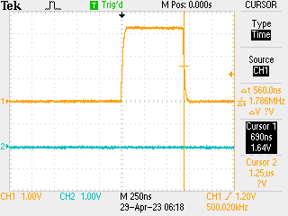

# Drive by IRQ Timing

SAMD51 drive-by-IRQ overwrite was fine, but there was a fair degree of jitter in the timing. Figuring out _why_ is an interesting question - probably due to multiple clock domains, with the periperals (i.e. EIC, PORT) on 48 MHz clock and CPU on 120 MHz. Turns out this is the case.

Following on from the [actual implementation](./2023-04-26.md) this time we reset the main clock (GCLK0) to come from the 48MHz PLL #6 rather than the 120 MHz clock with `mem32[GCLK_GEN0] = 0x2106` - makes for much slower operation (verified with some assembly to bit-bang the PORT registers) but much more steady timing:

So: TIL that clock domain synchronisation is a thing for real-time work.
