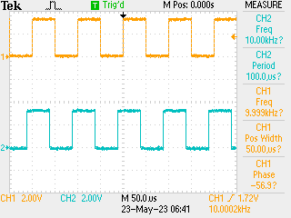

# Pico Clock Comparison

Randomly wondered about how consistent the clocks are between Raspberry Pi Pico instances: time to break out the 'scope with some trivial PIO driver:

```python
from machine import Pin
import rp2

p0 = Pin(0)

# counter program using side-set to control output
@rp2.asm_pio(sideset_init=rp2.PIO.OUT_LOW)
def square():
    wrap_target()
    mov(x, osr).side(1)
    label("high")
    jmp(x_dec, "high")
    mov(x, osr).side(0)
    label("low")
    jmp(x_dec, "low")
    wrap()


# because 50% duty cycle square wave, need frequency to be even
# in here: clock divider of 12.5 is fine
sm = rp2.StateMachine(0, square, freq=10_000_000, sideset_base=p0)

# counts: two fewer than you think:
#
# mov() takes one instruction
# jmp x_dec only jumps when x_dec comes in as zero
#
# clock into the osr before program starts
sm.put(500 - 2)
sm.exec("pull()")

sm.active(1)
```

Generate a 10kHz square wave (i.e. 50µs high / low) -> plot on scope, watch to see how the wave from Pico B advances with respect to Pico A (did this at 1MHz at first, so count of 5 - 2, but was too fast). Result?



Looks like it advanced at about 8°/s which I think is a relative difference in clock speed of about 2e-7. So pretty good then, 0.2ppm.
